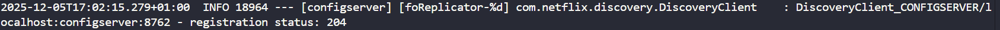
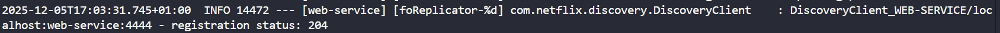
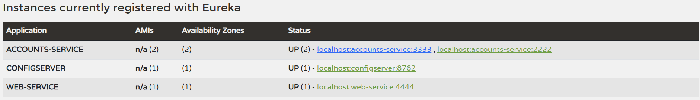
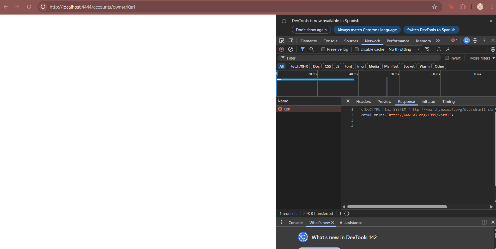
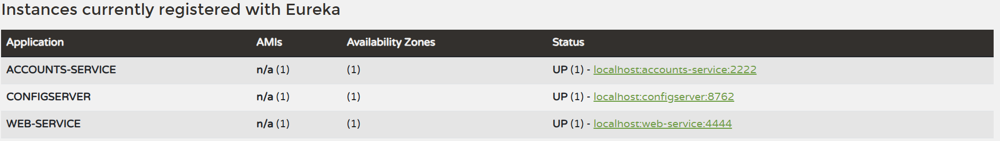

# Laboratorio 6: Microservicios - Informe

## 1. Configuración del Sistema (Configuration Setup)

### Descripción de los archivos de configuración
Los archivos de configuración se encuentran en el directorio `config/config/`. Este directorio actúa como un repositorio centralizado para las propiedades de todos los microservicios del sistema. En lugar de tener las propiedades "hardcodeadas" (incrustadas) en cada aplicación, el **Config Server** sirve estos archivos a los servicios durante el inicio a través de HTTP.

* **accounts-service.yml**: Contiene la configuración específica para el backend de Cuentas. Define el nombre de la aplicación, el puerto del servidor y los niveles de registro (logging).
* **web-service.yml**: Contiene la configuración para el frontend Web (MVC), incluyendo la URL/ID del Servicio al que debe llamar para obtener datos.

### Descripción de los cambios realizados
Modificamos el archivo `accounts-service.yml` para demostrar las actualizaciones dinámicas de configuración sin cambiar el código fuente.

* **Puerto Original**: 3333
* **Nuevo Puerto**: 2222

**Evidencia del cambio (`config/config/accounts-service.yml`):**
```yaml
spring:
  application:
    name: accounts-service  # Identifica esta aplicación

# Servidor HTTP
server:
  port: 2222   # Modificado de 3333

management:
  info:
    env:
      enabled: true
  endpoint:
    info:
      enabled: true
    health:
      enabled: true
  endpoints:
    web:
      exposure:
        include: "*"
```

Al reiniciar el Config Server y lanzar una nueva instancia del servicio Accounts, este tomó automáticamente el nuevo puerto (2222) mientras la instancia original permanecía en el 3333.

## 2. Registro de Servicios (Task 1)

### Proceso de Registro
Cuando un servicio (como accounts-service o web-service) arranca, actúa como un Cliente Eureka.

1. Lee la propiedad `eureka.client.serviceUrl.defaultZone` para encontrar el Servidor de Descubrimiento.
2. Envía una petición REST POST para registrar sus metadatos (IP, Puerto, Nombre del Servicio).
3. Mantiene un "latido" (heartbeat) para decirle al servidor que sigue vivo.

### Evidencia en Logs
A continuación se muestran los logs que confirman que ambos servicios se registraron exitosamente en el Servidor de Descubrimiento (el estado 204 indica éxito):

**Log del Servicio Accounts:**



**Log del Servicio Web:**



## 3. Dashboard de Eureka (Task 2)

### Análisis del Dashboard
La captura de pantalla a continuación muestra el Dashboard de Netflix Eureka ejecutándose en el puerto 8761.


**Instances currently registered**: Podemos ver ACCOUNTS-SERVICE y WEB-SERVICE listados.

**Disponibilidad**: Esto confirma que el mecanismo de descubrimiento funciona y los servicios son visibles entre sí sin necesidad de IPs fijas.

## 4. Múltiples Instancias (Task 4)

### Manejo de Múltiples Instancias
Eureka actúa como un registro de servicios dinámico. Cuando lanzamos una segunda instancia de ACCOUNTS-SERVICE (una en el puerto 3333, otra en el 2222), ambas se registraron bajo el mismo nombre de aplicación ACCOUNTS-SERVICE. Eureka mantiene una lista de todas las instancias disponibles para ese ID de servicio.

### Balanceo de Carga del Lado del Cliente
El Servicio Web (Cliente) utiliza Client-Side Load Balancing (a través de Spring Cloud LoadBalancer).

1. El cliente pregunta a Eureka por las direcciones disponibles de ACCOUNTS-SERVICE.
2. Eureka devuelve la lista: `[localhost:3333, localhost:2222]`.
3. El cliente decide localmente a qué instancia llamar (usando un algoritmo Round-Robin), distribuyendo el tráfico equitativamente entre las dos instancias del backend.



## 5. Análisis de Fallos (Task 5)

### Comportamiento ante Errores
Inmediatamente después de detener la instancia de ACCOUNTS-SERVICE (puerto 3333) mediante Ctrl+C, el Servicio Web intentó conectarse a ella porque su caché local aún contenía la dirección del servicio ahora muerto. Esto resultó en un fallo de conexión, mostrado como una página de error genérica y una petición de red fallida (Estado 500 o Connection Refused).

**Captura del Error:**



### Mecanismo de Detección de Fallos
Eureka utiliza un mecanismo de Latidos (Heartbeat) para detectar fallos.

1. Los servicios registrados envían un pulso a Eureka periódicamente.
2. Si Eureka no recibe un latido durante un periodo específico (configurado vía `eviction-interval`), asume que la instancia está muerta.
3. Entonces elimina la instancia del registro.


## 6. Análisis de Recuperación (Task 6)

### Por qué funciona la recuperación
La recuperación ocurre automáticamente debido al patrón de Descubrimiento Dinámico:

1. Una vez que Eureka desalojó la instancia muerta (puerto 3333), el registro solo contenía la instancia sana (puerto 2222).
2. El cliente del Servicio Web actualizó su caché local desde Eureka.
3. Las peticiones subsiguientes fueron enrutadas únicamente a la instancia sana (puerto 2222), restaurando la funcionalidad completa sin reiniciar el frontend.

### Tiempo de Recuperación
La recuperación tomó aproximadamente 5 segundos. Esta recuperación rápida fue posible porque configuramos `eureka.server.eviction-interval-timer-in-ms: 1000` y deshabilitamos self-preservation (configuración específica para Windows), permitiendo a Eureka detectar y eliminar el nodo muerto casi inmediatamente.

**Estado Recuperado:**



## 7. Declaración de IA (AI Disclosure)

### Herramientas de IA utilizadas
Google Gemini (LLM) fue utilizado como asistente técnico durante este laboratorio.

### Trabajo Original vs Generado por IA
**Trabajo Original**: Ejecución de todos los comandos, configuración del entorno, toma de capturas de pantalla, modificación de archivos de configuración, verificación de resultados y redactar primera versión de este reporte.

**Soporte de IA**: Se utilizó para entender los conceptos teóricos de Eureka (específicamente el mecanismo de desalojo y el modo de auto-preservación para entornos Windows), para entender el comportamiento del error de conexión durante la prueba de fallos, y para estructurar y formatear este informe en Markdown.